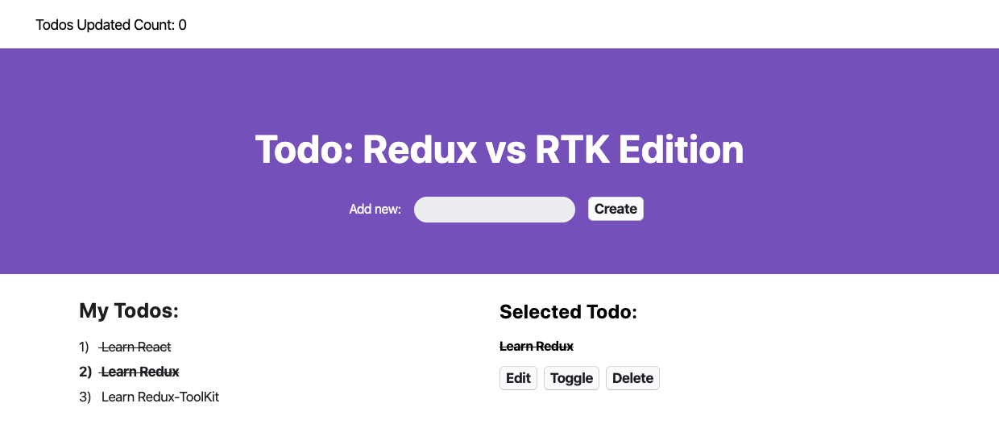

This is the starting place in conjunction with my **Redux Toolkit** comparison video. Please start here. NOTE: no dependencies related to Redux are installed here! Please follow along in the video and add them with me!

## How do I start the app??
1) .Clone reop
2) .Run cmd `npm i`
3) .Run cmd to start `npm start`

